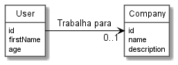

## Users

Vamos experimentar GraphQL. 

Usaremos um cliente que permite submeter requisições em GraphQL, 
assim não será necessário se preocupar com a interface, pelo menos enquanto aprendemos.

No lado do servidor teremos GraphQL (server) em execução, além de um banco
de dados "fake". Naturalmente, num sistema "real", usaríamos de um banco 
de dados real como MySQL ou MongoDB, por exemplo. Contudo, dado que o 
foco está em GraphQL, vamos usar uma
alternativa mais simples para o nosso aprendizado.

### Banco de dados "fake"

O papel do nosso banco de dados será desempenhado pela ferramenta
[json-server](https://github.com/typicode/json-server).

A ideia é simples, por um arquivo, por exemplo, [db.json](db.json), 
contendo dados iniciais a serem consultados e atualizados via GraphQL. 
O comando `json-server --watch db.json` coloca à disposição
uma API REST por meio da qual teremos acesso aos dados.

### Modelo de dados

Não poderia ser mais simples: usuários e empresas nas quais eles trabalham,
conforme ilustrado abaixo.

### Acesso o banco de dados "fake"

O acesso ao banco de dados será feita via [Axios](https://axios-http.com/). Novamente, a opção aqui é pela simplicidade e facilidade de
uso. Desta forma, podemos nos concentrar no servidor GraphQL sem nos
distrairmos.

### Servidor GraphQL

Nosso servidor GraphQL é colocado no "ar" por apenas 20 linhas de
código ([server.js](server.js)). Adicionalmente, também disponibiliza
cliente gráfico a partir do qual sentenças em GraphQL poderão ser
dirigidas ao nosso servidor.

Naturalmente, precisamos configurar...

### Configurando GraphQL (esquema)

A configuração é fornecida no arquivo [schema.js](schema/schema.js).
É neste arquivo que boa parte do nosso esforço é concentrado. Afinal,
é a partir dele que toda a flexibilidade oferecida por GraphQL
é configurada.
